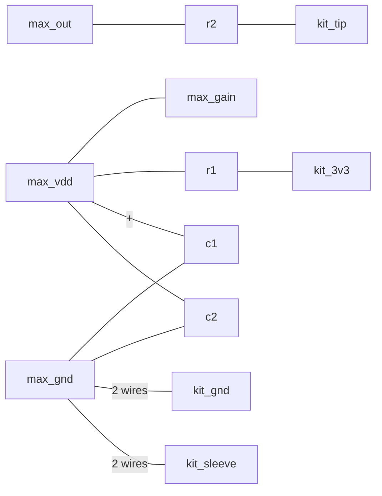

# Rotary Phone → Bluetooth Handsfree: Initial Design

Follow-on from `doc/initial_research.md`. That doc recommended "ESP32 + weeBell-style
SLIC/codec board, Bluetooth HFP to your cellphone" as the pragmatic path. This doc
captures where the design actually landed after working through the hardware and
firmware in detail — which turns out to be simpler than a full weeBell/SLIC build,
because we're only salvaging two mechanical parts from the donor phone rather than
the whole electrical network.

Related documents:
- `doc/tones.md` — verified tones, dial protocol and service behavior for the era profiles.
- `doc/audio_clips.md` — running list of the spoken prompts that need recording.
- `doc/audio_kit_v2.2.md` — the development board: parts, pins, schematic findings.
- `doc/validate_board_plan.md` — step-by-step plan to prove the board works before building the firmware.

**Status of this document:** decisions are marked **Decided** (you stated them) or **Proposed**
(my recommendation, not yet confirmed). **No firmware has been changed yet**; everything under
"Firmware changes" is a plan. Last updated 2026-09-20.

## Purpose

This is a **novelty item**, not a functioning utility bluetooth headset. That drives several
decisions below (for example, it deliberately cannot dial emergency numbers).

## The donor phone

A "Kellogg" branded phone (Kellogg Switchboard & Supply Co., no model number found).
Identified network components: an induction/repeat coil marked "113A", a capacitor
marked "225" (almost certainly the ringer's DC-blocking capacitor), and a biased
mechanical ringer with two coils each marked "2000" (presumed 2000Ω each, ~4kΩ
combined in series). Exact ring voltage/frequency/cadence this phone was originally
designed for is unconfirmed — no date code or model number was found — so those
values are treated as bench-tunable parameters, not fixed specs (see Ring Driver
section).

**Only two mechanical parts are being reused: the rotary dial and the bell ringer
(coils + gongs + clapper).** The carbon microphone, receiver, and the entire network
(induction coil + capacitor) are being replaced with modern parts. This is a
significant simplification from the original weeBell approach:

## Why no SLIC

weeBell's AG1171 SLIC exists to emulate a real central office: supplying loop current
to a live 2-wire circuit, generating ring voltage, and providing the hybrid/anti-
sidetone function a real phone's network coil used to do. Since we're not preserving
the carbon mic or the network, there's no shared 2-wire loop to emulate — every
salvaged/added component gets its own dedicated, point-to-point connection to the
ESP32/codec instead:

- Hook switch → GPIO (digital in)
- Rotary dial pulse contacts (+ dial-in-progress shunt contact) → GPIO (interrupt/pulse count)
- Bell coils → dedicated ring-driver circuit (own supply, own GPIO control)
- Microphone → codec line-in
- Speaker/earpiece → codec line-out

No hybrid, no loop current, no line-voltage feed anywhere in the design.

## Hardware platform

**ESP32-A1S "Audio Kit" style board** (ESP32 module + onboard audio codec + battery
management on one PCB), replacing the original ELEGOO bare ESP32-WROOM-32 boards as
the final build target (those remain as spares/dev boards for other experiments).

- Bluetooth 4.2 BR/EDR + BLE, WiFi — Classic BT with SCO/HFP support confirmed present.
- Audio: LINEN stereo line input, HPOUT headphone output, LOUT/ROUT 3W amplified
  output. **The MAX9814 mic module's output goes to LINEN (line-in), not the raw
  mic-in path** — the MAX9814 is already amplified/AGC'd, so feeding it into a
  mic-level input designed for a raw capsule would double-amplify and likely clip.
- **Open item: confirm actual codec chip (ES8388 vs AC101) before committing.**
  The ESP32-A1S product line shipped with both across hardware revisions; this
  firmware's existing `es8388.c` driver only works with the ES8388. Verify by chip
  markings or I2C bus scan once the board is in hand — do not assume from listing
  text alone.
- **Board reference:** the full research on this board is in `doc/audio_kit_v2.2.md`. Your board is
  marked "V2.2 A618" with "k547" on the antenna; neither appears in any source, and "V2.2" boards ship
  with different codecs and different pin maps. Confirm the codec and pin map on the board first
  (that doc, section 9).
- **Input and output paths (important; confirmed by the official pin table and schematic):**
  on ES8388 V2.2 boards the line-in jack and the onboard microphones share the codec's LIN2/RIN2
  input, and LIN1/RIN1 is unused. So the MAX9814 goes into the line-in jack, the firmware must select
  `LINE2` for input (today it selects `LINE1`), and the onboard microphones must be removed so they don't
  mix into the handset mic (see "Microphone", below). **The earpiece is on the speaker outputs (J3/J4)**: the codec's
  LOUT1/ROUT1 through the two class-D amplifiers, switched on by IO21 high. (The headphone jack, LOUT2/ROUT2, is a
  bench-test output.)
- **What the chips on the board are.** The Silicon Labs **CP2102** is the USB-to-UART bridge for
  programming and the serial console (UART0, GPIO1/3); it is **not** an amplifier. The audio codec is
  **inside the shielded ESP32-A1S module**, which is why the audio traces go straight into it. It can't
  be read off the board; identify it from an I2C scan (ES8388 at 0x10, AC101 at 0x1A). Two small
  class-D speaker amplifiers sit on the board and are **off by default** (a pull-down holds their enable
  line low); the earpiece is on their outputs, so **IO21 is the amp enable, driven high while audio plays**.
  Their outputs are bridged: neither speaker pin may be tied to ground. **Earpiece drive (stage 6, 2026-09-20):**
  the amplifiers are NS4150C (3 W into 4 Ω) and the earpiece is 4 Ω (3.4 Ω DC), so the hiss is audible and the level
  far too high when driven directly. **Fitted: a series resistor of 820 Ω in each speaker leg** (a pad, about -52 dB),
  with the codec near full scale. No audible noise; still slightly loud. The firmware must use the codec's full range
  (never quiet audio in the digital domain with the analog gain turned up). Tone shaping (a high-pass near 300 Hz, a
  treble cut) is done in software (the equalizer profiles, `eqp spk`) once real Bluetooth audio is playing.
  **Changed (stage 9, 2026-09-20): 160 Ω in each speaker leg** (about −38 dB, roughly 14 dB louder than 820 Ω). Phone-call
  speech averages about −16 dBFS, some 14 dB below the full-scale test tone the 820 Ω pad was sized with, so calls were quiet.
  The 160 Ω pad was fitted after trying the earpiece profiles with `eqp`; the hiss floor rises with the level, so listen for it
  with the call idle.
- **Pins change.** The firmware's current pin assignments are for the gCore board
  (I2C 21/22, I2S 25/19/26/34, ring 32/33, hook 35). The newest ES8388 A1S module puts the codec on
  I2C SDA 18 / SCL 23 and I2S BCLK 5 / WS 25 / DOUT 26 / DIN 35 / MCLK 0; older modules use I2C 33/32 and
  BCLK 27. Which one is on your board is unconfirmed (`doc/audio_kit_v2.2.md`, sections 4 and 9). Keep
  all pins in one header.
- **Only a few GPIOs are usable.** The header exposes only IO21, 22, 19, 23, 18, 5 (plus IO12, 13, 14, 15
  on the JTAG header). IO21 controls the speaker amps; IO23/18/5 are the codec's I2C and BCLK on the
  newest module; IO19 and IO23/18/5 are also wired into the button resistor ladder. We need **three
  inputs** (hook, dial pulse, dial-in-progress) and **two outputs** (DRV8825 STEP and nENABLE).
  **Decided** (stage 4, validated on the board; the optional boot-safety check was skipped; works with the SD card): hook on **IO13 (MTCK)**, active-high with
  the board's 10 kΩ pull-down and the contact to 3V3 (DIP SW4 ON); dial pulse on **IO18** and dial-in-progress on
  **IO23**, each with a pull-up; **IO22 = STEP** and **IO19 = nENABLE** (IO19 is slow, about 38 µs, so static
  signals only); **IO21 = speaker-amp enable**; the 10–100 Ω series resistor the spec recommends on each line. Reasoning in
  `doc/audio_kit_v2.2.md`, section 6.
- Battery: 3.7V LiPo on the board's 2-pin battery connector (type and polarity not stated; check
  before connecting), with an onboard linear charger. **Correction to the first draft:** the
  schematic shows **no boost converter**. On battery the "5V" rail is simply the battery voltage
  (about 3.0–4.2 V), and the 3.3 V rail comes from a step-down regulator, so the board may brown out
  near 3.5 V battery voltage. This is a separate power domain from the ring-voltage boost chain (below),
  and the board's rail is not expected to supply the ring driver. There is no battery fuel gauge and the
  charger status goes only to LEDs, so firmware cannot read battery state unless an ADC divider is
  added later.
- Programming/debugging: standard UART bootloader over USB-serial (`idf.py flash`),
  no JTAG/debug probe needed. Note: a Pico Probe / probe-rs workflow does **not**
  apply here — the ESP32 is Xtensa, not RISC-V, and probe-rs's Espressif support only
  covers Espressif's RISC-V parts (C3/C2/C6/H2). Flashing is UART-only regardless.

## Microphone

The handset microphone is a **MAX9814 electret microphone + AGC breakout** (5 pins: GND, VDD, GAIN, OUT, A/R). It
sits **inside the handset, next to the mouthpiece**, and reaches the base through an 8-wire cord. Its output goes into
the Audio Kit's **line-in jack, one channel only (the right one, on this board)**. It is a self-contained electret amplifier that runs from 3.3 V, so
no carbon-mic-style DC bias or current-loop circuitry is needed.

### Decisions

- **Module in the handset, not on the base PCB.** Only the already-amplified, low-impedance, AGC'd signal travels the
  long (6–8 ft) coiled cord, which is far more noise-resistant than running a raw high-impedance capsule signal that
  distance.
- **Line-in, not mic-in**, and **one channel only: the right (RIN2)**. Measured in stage 7 (2026-09-20): the signal on
  the plug tip arrives on the codec's *right* input, not the left the schematic suggests. The firmware therefore uses
  the right ADC. Codec setup is in "Firmware changes".
- **GAIN is strapped at the module**, so it never travels down the cord. **Decided (stage 7, 2026-09-20): GAIN = 40 dB
  (the lowest setting), A/R open (1:4000).** Speech at 5 cm already peaks at about −6 dBFS at 40 dB, so 50 and 60 dB would
  clip. If the microphone turns out too hot in the handset, attenuate it **physically** (open-cell foam or cloth over the
  capsule opening); no further electronic tuning is planned.
- **No software filtering** on the microphone path (the MCU is kept free for the other features). **Decided (stage 9, 2026-09-20):
  if the microphone sounds boomy or muffled, add a passive first-order high-pass:** a film or C0G capacitor of 0.047 to
  0.1 µF (corner about 330 to 155 Hz into the codec's roughly 10 kΩ input) in series with the signal, after `r2`, inside
  the handset. The value is chosen by listening in the final enclosure (the microphone profiles in `hwtest`, `eqp mic <n>`, audition high-pass corners and more;
  the software filter is second-order, so expect a slightly higher corner to match). A parallel resistor across the
  capacitor would make it a gentle shelf if the result is still dull. The microphone level is set by the digital gain
  (−12 dB, about volume digit 6): at 0 dB the far end heard clipping with the mouth 2 cm away.
- **The onboard microphones are removed** from the Audio Kit (see "The codec side").
- **Built without a PCB:** the component leads and cord wires are twisted together at each MAX9814 pin and soldered.

### Handset cord

**Decided (2026-09-20): an 8-conductor cord has been ordered.** The earlier plan (a coiled 3-conductor TRS headphone
extension) no longer works: the earpiece is on the bridged speaker outputs (two wires, neither may be ground) and the
MAX9814 needs supply, ground and signal. The cord is **8 straight wires** in a round bundle, so every wire is
equivalent to every other and it does not matter which is which. Use them as:

- 1 wire for the mic supply (3.3 V).
- 1 wire for the mic signal.
- 2 wires in parallel for the power ground (the supply return).
- 2 wires in parallel for the signal ground.
- 2 wires for the earpiece (through the 160 Ω pad in each leg at the amplifier end; not part of the microphone diagram).

Supply current returns on the power ground and the signal returns on the signal ground. The two grounds are joined
**only at the MAX9814's GND pin**, so supply current never flows in the signal return. Keep the microphone module away
from the earpiece (acoustic feedback).

### Terminals and components

The diagram below shows what connects to what. A **node** is a place where leads meet, and each **line** is one wire or
one component lead. At a node, twist all the leads on its lines together and solder them there.

**Audio Kit terminals (the base end of the cord):**

- `kit_3v3`: a 3V3 header pin (P3 or P4).
- `kit_gnd`: a GND header pin.
- `kit_tip`: the tip of a 3.5 mm plug for the line-in jack J1. On this board it reaches the codec's **right** input
  (RIN2), measured in stage 7.
- `kit_sleeve`: the sleeve of that plug.

**MAX9814 module pins** (A/R is left open):

- `max_vdd`, `max_gnd`, `max_gain`, `max_out`.

**Components**, fitted at the module's own pins inside the handset, not at the far end of the cord. They do not
duplicate the module's own parts (below): `c2` (before the module's ferrite bead) and the module's 2.2 µF form a
capacitor-inductor-capacitor filter, `r1` and `c1` add low-frequency filtering (the 3.3 V header comes from a switching
regulator), and `r2` has no equivalent on the module.

- `r1`: **22 Ω**, 0.25 W. Drops about 66 mV at 3 mA. Together with `c1`, the corner is about 150 Hz (47 µF) to 70 Hz (100 µF).
- `r2`: **220 Ω**. Isolates the cord's capacitance from the amplifier output and adds RF and static protection; costs
  about 0.2 dB into the codec's roughly 10 kΩ input.
- `c1`: **47 to 100 µF**, 10 V electrolytic (a 3300 µF 6.3 V also works electrically). **Plus leg on `max_vdd`.**
- `c2`: **100 nF** ceramic (X7R), with short leads.
- **GAIN strap** (the `max_gain` to `max_vdd` line): a removable link, not a component. To `max_vdd` = **40 dB**, to
  `max_gnd` = **50 dB**, removed = **60 dB**. Power the module off and on after moving it.
- **A/R** (not drawn): left open = 1:4000, and no other setting is planned. (Linking `max_ar` to `max_vdd` gives 1:2000
  and to `max_gnd` gives 1:500, if it is ever wanted.)

### What is already on the module

Assumed to be the Adafruit MAX9814 board (product 1713) or a clone. Its EAGLE schematic shows the header order **GND,
VDD, GAIN, OUT, A/R** (**follow the silkscreen names**, and wire by name, not by position). A **ferrite bead in series
with VDD and one in series with GND** sit between the header and the chip; a **2.2 µF ceramic** across the chip's
supply; /SHDN tied to VDD; the electret capsule with a 2.2 kΩ bias resistor; and small timing and decoupling parts on
the chip (0.1 µF on CT, 2.2 µF on CG, 0.47 µF on BIAS, a 0.1 µF input coupling capacitor, a 150 kΩ / 100 kΩ threshold
divider). **OUT goes straight from the chip to the header: no series resistor and no output capacitor.** GAIN and A/R
go straight to the chip with no strap (open = 60 dB, 1:4000). No electrolytic. Supply 2.7 to 5.5 V at about 3 mA.
OUT sits at about 1.25 V DC, which the board's line-in coupling capacitors block.

**Confirm your module matches** (unpowered, meter): capacitance from the VDD header pin to the GND header pin reads
about 2 µF; the GAIN and A/R pins read open to both VDD and GND.

### Wiring

Terminals and components are described above. The lines that reach a `kit_*` node are cord wires; the two labelled
"2 wires" are two cord wires in parallel. The `c1` line marked "+" is its plus leg. Keep every lead short.

### Checks

- **Unpowered (meter):** no short between VDD and GND (the reading rises as the capacitors charge); about 2 µF between
  VDD and GND before `c1` and `c2` are fitted (the module's own capacitor); GAIN and A/R open to both VDD and GND on
  the bare module.
- **Powered from the 3V3 header:** the `max_vdd` pin about 3.2 V; the `max_gain` pin equal to it with the strap fitted;
  `max_out` about 1.25 V DC. If `max_vdd` is below about 3.0 V, replace `r1` by a wire link or a smaller resistor.

### The codec side

Firmware details are under "Firmware changes"; the microphone-related points are:

- On this board the plug tip reaches codec **RIN2** (through C13), not LIN2 (C11) as the schematic suggested (stage 7:
  a signal on the tip appeared only on the right channel). A continuity check from the plug tip to C13's jack-side pad
  would confirm it.
- Firmware selects `LINE2`, powers down the left input and ADC (register 0x03 = 0xA9) and sends the right ADC to both I2S
  slots (register 0x0c = 0x8c), so the jack's other contact is not used. The codec's input amplifier is set to 0 dB (the
  driver's default is +9 dB); the MAX9814's gain does the work.
- **Remove the onboard microphones** (test 2 in stage 7 of `doc/validate_board_plan.md`). C18 and C20 are too small
  to handle by hand; removing them is only the fallback if a microphone is still heard.

## Ring driver

Bell coils: two ~2000Ω windings in series (~4kΩ combined), driven with an AC-like
square wave. Power draw is tiny (~2W at 90V, less at lower voltage) — current is
never the constraint here, voltage headroom is.

### Driver: DRV8825 stepper motor driver module

Run in "dumb" mode:

- Rated 8.2–45V, well above the ~36V a comparable reference build (a documented
  Arduino-based vintage-ringer project) reported as "ample for maximum volume" on a
  similar bell. 90V central-office spec is a conservative full-strength number, not
  a confirmed requirement for this phone.
- DRV8825 is a plain chopper-type driver (no StallGuard/CoolStep/sensorless smart
  features) — current-limit trimpot set to maximum so the chopper never engages
  against our ~4kΩ (way-below-trip-point) load, which makes it behave as a simple
  voltage-mode H-bridge rather than a current-regulated motor driver.
- One phase's H-bridge output drives the bell coils; STEP clock rate sets the output
  frequency arbitrarily and precisely (software-controlled, not fixed by any onboard
  oscillator) — full-step mode gives a direct, computable ratio between STEP rate and
  output frequency. (Full-step should give about four STEP pulses per output cycle;
  **verify on the bench**.)
- ENABLE/DIR/STEP are plain 3.3V logic, direct from ESP32 GPIO/timer/PWM.
- **Proposed:** the DRV8825 ENABLE pin is enabled by default through an internal
  pulldown, so add an **external pull-up on nENABLE** to keep the bell off while the
  ESP32's pins float during reset and boot.
- **Proposed:** generate STEP with a hardware timer (LEDC or MCPWM), not by toggling a
  pin from the firmware's 10 ms loop, which would jitter. Gate the bell with ENABLE and
  a cadence timer.
- **No series capacitor.** Considered as fault-tolerance insurance against a firmware
  hang leaving sustained DC across the coil, but decided against: at the actual
  operating voltage (running at roughly half the DRV8825's 45V ceiling, current
  limit wide open) the worst-case stuck-DC fault current into the ~4kΩ coils is only
  ~11mA even at the full 45V ceiling (`P ≈ 0.5W`) — well within what a ring-service
  coil tolerates indefinitely. Without the cap, a firmware fault just means the bell
  goes silent (clapper held to one side) until the fault clears, not a
  hardware-damaging condition. Not worth the part given how benign the failure mode
  already is. (A non-polarized/film capacitor, ~10-22µF at this coil's ~4kΩ
  impedance, remains the fix if this assessment changes — e.g. if a higher-voltage
  driver is adopted later.)
- Considered and rejected: two DRV8825 boards with tied inputs and series-stacked
  outputs to double voltage headroom (cascaded H-bridge / multilevel-inverter
  topology). Rejected because it requires fully galvanically isolated power *and*
  control interfaces per stage to avoid shorting through a shared ground — more
  isolation engineering than just using a single higher-voltage-rated driver.
- Fallback path if 45V proves insufficient on the actual bell: TB67S249FTG (47V,
  still "dumb"), then TMC5160 (up to 60V, a "smart" chip but usable in plain
  STEP/DIR standalone mode without engaging its sensorless features).
- Explicitly ruled out: BTS7960/IBT-2 (27V ceiling, monolithic — no MOSFET-swap
  escape hatch), reversed mains/doorbell transformers driven at 20Hz (real saturation
  risk at 1/3 of their rated frequency — a documented hobbyist build of this exact
  approach failed, producing pulsed/DC-like output instead of clean AC), EL-wire
  inverters (right voltage range, wrong/fixed frequency — 60Hz-2kHz internal
  oscillator, far too fast for a mechanical clapper to track), and industrial
  enclosed stepper drivers like DM556/DM860 (right voltage range, physically too
  large — ~4.6"×3.0"×1.3").

### Ring-driver power

A two-stage boost from the LiPo, separate from the ESP32-A1S
board's own 5V system rail. Both stages use the same **XL6019-family adjustable
boost module** (3-35V in, 5-40V out, ~5A):
1. ~3V (battery) → ~12V
2. ~12V → adjustable, trimmed to whatever voltage bench testing shows is actually
   needed, up to the DRV8825's 45V ceiling

Using the same compact/low-power module family for both stages keeps the BOM simple.
Note this specifically does **not** cover a future upgrade to a higher-voltage driver
(TB67S249FTG @47V or TMC5160 @60V) — the compact/low-power modules available in that
45-90V range have a floor around 80-90V (nixie-tube-supply family), which would
overvolt the DRV8825 rather than trim down to it. If a higher-voltage driver is
adopted later, stage 2 needs to be swapped for one of those instead, not just
re-trimmed.

### Bench-test plan

Not yet executed: sweep drive frequency roughly 15-35Hz at
reduced voltage to find the bell's actual mechanical resonance (its real "hammer
frequency," rather than assuming the 20Hz US-standard default); then bring voltage up
to find the actual loudness-vs-voltage curve on this specific bell, rather than
assuming either the 90V central-office figure or the 36V reference-build figure
applies here.

### Ring cadence

North American standard 2 seconds on / 4 seconds off (33% duty
cycle) is the default plan — configurable, easy to change, no reason yet to deviate.
The current firmware rings once per Bluetooth `RING_IND` from the cellphone, so the
cadence would depend on the phone's timing. **Proposed:** time the 2 s / 4 s cadence in
firmware from the first ring until the call is answered or ends (the app-task "last ring"
timeout is 7 s, which fits a 6 s cycle). The ring cadence is not part of the tone-era
profiles: profile C (UK) uses a different double-ring cadence (`tones.md`).

## Control interface — no touchscreen

The original gCore/LVGL touchscreen UI is being removed entirely. Everything the
screen used to do gets replaced by the phone itself.

### Decisions

- `components/gui`, `components/gui_assets`, `components/lvgl*`, `gui_task.c/h`, and
  the display init in `main.c` get deleted.
- **RTC/time** is dropped entirely. The only place time was used was the
  `CLIP_DATETIME` field in outgoing Caller ID messages (`pots_task.c`), and Caller ID is
  being removed.
- **Bluetooth pairing, forget-pairing, volumes, and tone era** move to the modal dial
  interface below.

**Changed from the earlier draft:** locale and gain were going to be compile-time constants.
They are now user-selectable at run time by dial modes (below), so a small amount of
persistent storage is needed (see "Persistent settings").

### Modal dial interface

After the handset goes off-hook, the **first digit dialed selects a mode**. **Decided** (modes 1–6):

| First digit | Mode | Notes |
|---|---|---|
| `1` | Place a call | see "Dialing rules" |
| `2` | Bluetooth pairing | see "Bluetooth pairing via the dial itself" |
| `3` | Earpiece (speaker) volume | one digit sets it, then the number is spoken |
| `4` | Microphone volume | one digit sets it, then the number is spoken |
| `5` | Tone era | one digit selects an era profile (`tones.md`) |
| `6` | Forget pairing | dial `6` again to confirm; the phone then says it is unpaired |
| `7` | Microphone equalizer | **Proposed:** one digit selects a profile (`0` = off), then the number is spoken; see "Equalizer profiles" |
| `8` | Earpiece equalizer | **Proposed:** one digit selects a profile (`0` = off), then the number is spoken |
| `0`, `9` | Unassigned | **Proposed:** an error indication (tone or clip) if dialed at the mode step |

Rules:
- **Once a mode is selected, digits 0-9 are all ordinary numeric input for that
  mode** — `0` has no special/global meaning inside a mode.
- **Going on-hook (hangup) unconditionally cancels whatever mode is active** and
  returns to idle. This still needs to be audited against the existing `app_task` state
  machine once implemented — the on-hook handler currently resets call-related
  states; it needs to also cleanly unwind any in-progress special-mode state (for
  example, mid-passkey-entry or a pending forget-pairing confirmation).
- The old "dial `0` alone starts voice assistant" behavior (`_appCanInitiateAssistantCall`) is
  not in the mode list. **Open:** drop it, or give it one of the unassigned digits.

### Dialing rules (mode 1) — Decided

- The `1` that selects the mode is consumed as a mode, then **exactly 10 more digits** are
  collected. The firmware then sends **`1` + those 10 digits** to the cellphone, so the number
  always carries the North American country code. This limits calls to North American Numbering
  Plan numbers (US, Canada and Caribbean nations, including toll-free and premium-rate numbers).
  A blocklist of area codes (for example 900 and some Caribbean codes) is optional.
- The call is placed **as soon as the 10th digit is dialed.** There is no fixed inter-digit
  timeout like the old 4 s wait; only a short (sub-1-second) pause is used to decide a single
  digit is finished.
- **911, 811 and 7-digit numbers are deliberately not dialable**, because nothing is sent until
  10 digits are entered. It is a novelty item, not a utility phone.
- **An incomplete number (fewer than 10 digits) is handled per era — Decided** (see "Behavior by
  era"): in the two step-by-step-style eras (US pre-1965, UK) you hear silence until you hang up
  or dial more, and in the US Precise era you get a reorder tone after about 16 seconds.
- Digits dialed while a call is already active are still sent as DTMF to the cellphone
  (existing behavior, unchanged).

### Volume model — Decided (mode 3 and 4)

- One digit sets the level. **Digit `1` is the quietest and `0` is the loudest** (`0` comes after
  `9` on the dial), **neither is zero or full-scale**, and the steps are **even in dB**.
- 10 levels, 11 equal intervals: digit `d` maps to step `k = d` (with `0` → `k = 10`) and
  `gain_dB = min_dB + (k / 11) × (max_dB − min_dB)`.
- **Range: keep the existing `gain.h` limits** (stage 6, 2026-09-20: the volume steps work well on the earpiece with
  the 820 Ω pads; no narrowing needed for now):

| | Range | Step | Level `1` | Level `0` |
|---|---|---|---|---|
| Earpiece | −43.5 to +4.5 dB | 4.36 dB | ≈ −39.1 dB | ≈ +0.1 dB |
| Microphone | −39 to +9 dB | 4.36 dB | ≈ −34.6 dB | ≈ +4.6 dB |

- Expect the bottom steps to be too quiet to be useful (raise the floor after listening) and the
  microphone top step to risk clipping on top of the MAX9814's own gain/AGC (lower the ceiling if
  so). Only the two range constants change.
- After the level is set, the phone **speaks the number that was set** (`audio_clips.md`: a label
  clip such as "Earpiece volume", then the digit clip). The digit is the one dialed, so "zero"
  means loudest.
- These values persist across power cycles.

### Tone era — Decided (mode 5)

- One digit selects an era profile, and the phone says the number (and later the name) of the
  selected era. **Only verified tones are used** (`tones.md`). **Decided** assignments: **`1` = US
  pre-1965, `2` = US Precise Tone Plan (1965 onward), `3` = UK GPO Strowger** (only partly verified;
  its ringback tone is a flagged placeholder). No other eras for now.
- The era sets more than tones: it also sets the off-hook and partial-dial behavior and the busy
  tone used for a failed call (see "Behavior by era").
- The choice persists across power cycles.

### Equalizer profiles — Proposed (mode 7 microphone, mode 8 earpiece)

Each direction has ten profiles; the digit dialed selects one and `0` is flat (bypassed). A profile is up to three
second-order filter sections (high-pass, low-pass, peaking, low or high shelf) and a pre-gain that gives back the headroom
a boost uses. They are **starting points to judge by ear and by recordings**, not final values, and are built and tested in
`hwtest` (`eqp`, `sweep`, `noise`, `rec`, `hwtest/main/eq.c`). The chosen numbers go into the firmware, and the two chosen
digits persist like the volume digits.

**Where they act.** The microphone profile filters the codec's input before anything uses it (calls, recordings); the
earpiece profile filters the audio just before the codec. The tone generators and clips go through the earpiece profile too.

**Cost.** Biquads are cheap: high-pass plus shelf measured **96 cycles per sample, 0.64% of one core** at 16 kHz with the
product's compiler and 240 MHz settings; a three-section profile is about 1%. `eqp bench` times every profile.

**Microphone profiles**, for what a plastic handset housing does to a capsule behind a few small holes: the highs fall away
above about 3 kHz, the cup and holes resonate between 1.5 and 3 kHz (honky), close talking and a sealed cavity boost the bass, and
handling adds rumble. The passive high-pass planned in "Microphone" may already be fitted, so these high-pass corners are modest.

| Digit | Name | Aim |
|---|---|---|
| 0 | flat | none |
| 1 | light lift | mild loss: 120 Hz high-pass, +3 dB above 3 kHz |
| 2 | housing loss | typical loss: 150 Hz high-pass, +6 dB above 2.8 kHz |
| 3 | housing loss strong | thick wall or foam: 180 Hz high-pass, +9 dB above 2.5 kHz, +2 dB at 3.6 kHz |
| 4 | tame cavity | honky resonance: −6 dB at 2 kHz (narrow), +3 dB above 3.5 kHz |
| 5 | reduce boom | 250 Hz high-pass, −4 dB below 400 Hz |
| 6 | telephone band | 300 Hz to 3.4 kHz only |
| 7 | presence | 180 Hz high-pass, +5 dB at 3 kHz |
| 8 | muffled and boomy | −5 dB below 300 Hz, +7 dB above 2.5 kHz |
| 9 | clarity | 200 Hz high-pass, +3 dB at 1.5 kHz, +4 dB above 3 kHz |

**Earpiece profiles**, for a small 4 Ω receiver: little output below 300 Hz (worse if it does not seal to the ear), a harsh peak
between 2 and 3 kHz, a fall-off above about 4 kHz, and a fixed hiss that a high boost would raise.

| Digit | Name | Aim |
|---|---|---|
| 0 | flat | none |
| 1 | telephone | 300 Hz to 3.4 kHz only; also hides the amplifier hiss |
| 2 | tame harsh | −4 dB at 2.5 kHz, −3 dB above 4.5 kHz |
| 3 | bass lift | receiver not sealed to the ear: +6 dB below 350 Hz |
| 4 | clarity | 250 Hz high-pass, +3 dB at 2.8 kHz |
| 5 | warm | +3 dB below 500 Hz, −5 dB above 3 kHz |
| 6 | intelligibility | for hard of hearing: 300 Hz high-pass, +4 dB at 2 kHz, +2 dB above 4 kHz |
| 7 | low hiss | 4 kHz low-pass, −6 dB above 3 kHz |
| 8 | loud | 350 Hz high-pass, +3 dB at 1.2 kHz |
| 9 | soft wideband | +3 dB below 300 Hz, −4 dB above 5 kHz |

This reverses the earlier "no software filtering on the microphone path" for the case where the housing needs it; a passive
high-pass (see "Microphone") can still do part of the job. The persistent settings gain two digits (below), and
`audio_clips.md` gains two label clips.

### Bluetooth pairing via the dial itself

**Stage 9 finding (2026-09-20): passkey entry does not work with an iPhone; use Just Works.** With KeyboardOnly the
iPhone never displayed a passkey, and pairing failed after about 30 s. With NoInputNoOutput (Just Works) it paired at once
and connected HFP. Apple's guidelines (section 2.1.5) only name Numerical Comparison. **Proposed change:** dial mode 2 opens
a timed discoverable window (about 3 minutes; a phone can take a long time to find it) with IO capability NoInputNoOutput,
and the user pairs from the phone (tap Pair, possibly choosing a device type). No digits are collected, so the
"collecting passkey" state, the `ESP_BT_GAP_KEY_REQ_EVT` move out of the debug block and `ESP_BT_IO_CAP_IN` below are not
needed. Anyone in range during the window can pair, as with any headset. The text below describes the original plan.

Standard headset pairing uses one of a few Bluetooth Secure Simple Pairing (SSP)
association models depending on each device's declared I/O capability:

- `ESP_BT_IO_CAP_IO` (Display+YesNo) → Numeric Comparison — what the current GUI
  build uses (shows a 6-digit code to eyeball-compare against the phone).
- `ESP_BT_IO_CAP_IN` (KeyboardOnly, no display) → **Passkey Entry** — the model this
  design uses instead: the iPhone displays a 6-digit passkey, and the "keyboard" that
  enters it back is the rotary dial.

Per the ESP-IDF header (`esp_gap_bt_api.h`), the SSP passkey is always exactly a
6-digit decimal number (`000000`-`999999`) — i.e. only digits 0-9, exactly what a
rotary dial already produces, no new decoding logic needed.

Implementation sketch in `bt_task.c`:
0. **Turn SSP on:** the main firmware's `sdkconfig` has `CONFIG_BT_SSP_ENABLED` **off** (found in stage 9), so all the
   `#if (CONFIG_BT_SSP_ENABLED == true)` code below is compiled out today and the phone pairs with a legacy PIN. Set it to
   `y` (`hwtest` already does).
1. Change `iocap` (currently `ESP_BT_IO_CAP_IO` at `bt_task.c:794`) to
   `ESP_BT_IO_CAP_IN`.
2. On `ESP_BT_GAP_KEY_REQ_EVT`, enter a "collecting passkey" state and route the next 6
   dialed digits there instead of into the normal number buffer. **Note:** that event's case
   currently sits inside the `#ifdef BT_GAP_EVENT_DEBUG` block (it runs from about line 379 to
   425), so it is not compiled in a normal build. It has to be moved out of that block.
3. Once 6 digits are collected, call `esp_bt_gap_ssp_passkey_reply(bd_addr, true, passkey)`.
4. Use spoken clips for pairing feedback (start, success, failure, timeout; see
   `audio_clips.md`) in place of on-screen status, since there's no display.

#### Forget pairing (mode 6) — Decided

Dialing `6` plays a prompt asking you to dial `6` again to
confirm; dialing `6` again removes the bond and says the phone is now unpaired. Hanging up cancels.
**Proposed:** dialing any other digit at the prompt also cancels.

### Hidden jobs the GUI did that must move elsewhere

Found while reading `gui_task.c` and `components/gui`; each needs a new home:

- Saving the pairing info when pairing succeeds, and clearing it when pairing is forgotten.
- The 60 s pairing timeout (`GUI_MAX_PAIR_MSEC`).
- Sending `BT_NOTIFY_ENABLE_PAIR`, `DISABLE_PAIR`, `FORGET_PAIR`, `CONFIRM_PIN`, `DENY_PIN` to `bt_task`.
- Mic mute (to `audio_task`) and ring mute / do-not-disturb (to `pots_task`).
- Country/locale selection (`POTS_NOTIFY_NEW_COUNTRY`), now replaced by the era mode.
- Codec gain updates from the settings screen (now the volume modes).

## Persistent settings — Proposed

`ps.c` stores everything in the gCore EFM8's RAM over I2C, which this board does not have. It
should be replaced with a small ESP-IDF NVS store (NVS is already initialised for Bluetooth bonds)
holding just:

- earpiece volume digit
- microphone volume digit
- tone era
- microphone equalizer digit (0 = off)
- earpiece equalizer digit (0 = off)

Pairing state is best taken from the Bluetooth bond list itself, with a single-bond rule, instead
of a separate stored copy. That removes the case where the stored copy and the bond list disagree.
Brightness and country code are no longer needed.

## Tones and service behavior

Tones are **generated** in firmware, with the sources and numbers in `doc/tones.md`. Only verified
tones are included in the era profiles. Behaviors to implement, drawn from that document:

- The dial's off-normal contact mutes the earpiece while dialing (no pulse clicks in the audio),
  which is authentic.
- Dialed pulses are ignored while a busy tone plays.
- Ringback tone is generated locally when the cellphone reports the call is alerting (HFP
  `callsetup` = 3). **Open:** whether to mute the cellphone's own in-band ringback in the call
  audio so the period tone plays instead.
- Ringing stops immediately when the handset is lifted.

### Behavior by era — Decided

The era selected in mode 5 sets these behaviors as well as the tones. Each is matched to the era
as closely as the sources in `tones.md` (section 7) allow; the numbers marked "start" are values to
tune on the bench.

| Situation | US pre-1965 | US Precise (1965+) | UK GPO (partial) |
|---|---|---|---|
| Off-hook, nothing dialed | dial tone until you hang up or dial; no timeout | dial tone for about 50 s (start), then the off-hook howler | same as US pre-1965 (inferred) |
| Fewer than 10 digits dialed, then you stop | silence until you hang up or dial more | reorder tone after about 16 s (start) | same as US pre-1965 (inferred) |
| Call ends without being answered | busy tone, 60 per minute | busy tone, 0.5 s on / 0.5 s off | busy tone, 400 Hz, 0.75 s on / 0.75 s off |
| Dial pulses while busy plays | ignored | ignored | ignored |

- The no-timeout eras will feel like a dead phone if you stop mid-number; that is the documented
  behavior, and hanging up resets. **Proposed:** one compile-time constant per era (0 = no timeout)
  so it can be changed without code changes.
- The firmware **cannot distinguish a busy line from a failed call**: the cellphone's Bluetooth
  handsfree profile reports that the call ended, not why. Every unanswered end gets the era's busy
  tone.
- Ringback is generated locally per era, driven by the cellphone reporting that the call is alerting
  (see above).

## Audio clips

**Decided:** voice prompts are stored on the **microSD card**, so there can be many more of them and at
higher quality than would fit in flash. The full list to record, with status, is `doc/audio_clips.md`.

- **Format:** 16-bit mono WAV, **all clips in one large WAV (a "bank") plus an index of clip boundaries** (clip ID,
  start sample, length), with per-clip files as the fallback (`doc/audio_clips.md`). **Two banks, 8 kHz and 16 kHz, are
  in the design**: active notifications such as "battery low" can play during a call, so the firmware picks the bank
  that matches the codec's current I2S rate (8 kHz for a CVSD call, 16 kHz for mSBC or when idle) and never re-clocks
  the codec mid-clip. Stage 6 found no audible quality difference between 16, 22.05 and 44.1 kHz on the earpiece, so
  nothing above 16 kHz is stored.
- **SD wiring cost:** 1-bit SD mode uses **IO14 (CLK), IO15 (CMD) and IO2 (DATA0)**; 4-bit mode also uses IO4,
  IO12 and IO13, which the GPIO budget cannot spare. Stage 4 found enough clean GPIOs for everything else (see
  the pin decision above), so 1-bit mode it is. DIP: SW3 ON and SW4 ON.
- **Interrupt slots (stage 8 finding):** with the SD card mounted, installing the I2S driver with
  `ESP_INTR_FLAG_LEVEL1` failed (`ESP_ERR_NOT_FOUND`), because the level-1 slots were used up. The main firmware's I2S
  setup must allow any interrupt level (`intr_alloc_flags = 0`) once the SD card is added.
- **Card format (stage 8 finding, Proposed):** **FAT32 with an MBR partition map and large clusters** (macOS's `diskutil
  eraseDisk FAT32 NAME MBRFormat` gives 32 KB clusters on a 64 GB card). Cards over 32 GB arrive as exFAT and will not
  mount. Seek time in the bank depends on the cluster count: a random seek plus 4 KB read took about 8 ms (95th percentile
  9.4 ms) with 32 KB clusters, against 15 ms (95th percentile 29 ms) with 2 KB clusters on a small FAT16 card. So the bank
  option works without fast seek on a large-cluster card. The card runs 1-bit SDMMC at 20 MHz. **Read through POSIX
  `open()`/`lseek()`/`read()`, not stdio `fopen`/`fread`:** stdio refills a small internal buffer, and measured 570 KB/s
  and an 8 ms seek plus 4 KB read, against 1900 to 2350 KB/s and 3.2 ms (95th percentile 4.7 ms) with POSIX reads.
- **Risks to test:** some boards will not boot with a card inserted; the card slot lines are strapping-pin
  sensitive; a missing or failed card should not leave the phone silent (**Proposed:** keep a very small set
  of built-in fallback prompts, or fall back to tones). **Never format the card automatically** (the
  existing sample-recording code does; do not reuse it).
- **Proposed** playback implementation: a one-shot "clip" state in `pots_task` (the existing sample-based
  tone path loops forever), streaming from the file in chunks, using the same pattern DTMF and Caller ID
  audio already use to signal completion. Hanging up or dialing a digit interrupts a clip.

## Firmware changes (plan — nothing implemented yet)

Findings from reading the current firmware (`gcore_pots_bt/`). Why it fails on a bare board today:
`app_main` runs `ps_init()`, which talks to the missing gCore chip; `gcore_task` runs `power_init()`
against it; `audio_task` and `bt_task` call `gui_set_fatal_error()` on failure.

### Remove

**Proposed**, in this order; build after each step:

| Remove | Notes |
|---|---|
| `gui_task.*`, `components/gui`, `gui_assets`, `lvgl`, `lvgl_drivers` | Also the `EXTRA_COMPONENT_DIRS` line, `main/CMakeLists.txt` `REQUIRES` and `LV_CONF_INCLUDE_SIMPLE`, and 109 `CONFIG_LV_*` lines in `sdkconfig`. |
| `gcore_task.*`, `components/gcore` (except what replaces `ps`) | gcore, power, RTC and time utilities. |
| `sample.c`, `AUDIO_SAMPLE_ENABLE`, `SCREENDUMP_ENABLE`, `fatfs` | The SD-card audio dump. |
| Caller ID: `adsi`, `fsk`, `crc`, `queue`, `async` spandsp files, the CID state machine in `pots_task.c`, RP-AS and line reverse | A rotary phone has no display. |
| DTMF receive (`dtmf`, `super_tone_rx`, `tone_detect`) | Rotary dial only. |
| `international.c` country table and `audio_assets/*` | Replaced by the era profiles from `tones.md`. |
| `ps.c` | Replaced by NVS (see above). |

Let the compiler and linker show what is left over. Commit or stash the dirty `sdkconfig` and
`dependencies.lock` first. `app_task.c` needs its GUI and gcore hooks removed (GUI digit and
dial-button notifications, gain notifications, activity pings, status updates). `bt_task.c` needs its
GUI notifications and gain plumbing removed.

### Change

- **Pins** (see Hardware platform), and confirm the codec chip.
- **`audio_task`:** remove the `rx * -1` AG1171 inversion; select `LINE2` for both input and output in the
  codec config for input (line-in = LIN2/RIN2); the output is LOUT1/ROUT1 (the speaker outputs to the earpiece,
  DAC power 0x30, with IO21 driven high to enable the amps); replace `gui_set_fatal_error` with a log.
  **Fix `es8388.c`'s output enables:** its `DAC_OUTPUT_*` constants do not match the DAC power register (0x04: bit 5
  LOUT1, 4 ROUT1, 3 LOUT2, 2 ROUT2). `LOUT2|ROUT2` must be 0x0c, not 0x28, or only the left channel plays (confirmed in
  stage 6); `LOUT1|ROUT1` must be 0x30.
  **Input path:** select `LINE2` (LIN2/RIN2, the line-in jack). The onboard microphones share those inputs, so they are
  removed in hardware (remove the microphone parts themselves; C18 and C20 are too small to handle). Use the right channel only (the plug tip arrives on RIN2 on this board, stage 7): power down the left input and
  ADC (ADC power 0x03 = 0xA9) and send the right ADC to both slots (register 0x0c = 0x8c). The driver's PGA is +9 dB
  (0x09 = 0x33); use 0 dB and let the MAX9814 gain do the work. The firmware already reads only the left slot, which
  then carries the right ADC's data.
  **Proposed:** drop the line echo canceller (it existed for the SLIC hybrid). If dropped, also
  remove `esp_hf_client_send_nrec()` in `_btSetState`, which tells the cellphone to disable its own
  echo cancellation.
- **`pots_task`:** replace the single hook/pulse line with separate GPIOs (hook, dial pulse,
  dial-in-progress). This removes the `ON_HOOK_PROVISIONAL` state and its 500 ms wait, which existed
  only to tell pulses from a hangup. Replace `_potsLineReverse` / `_potsLineRingMode` with the
  DRV8825 STEP/ENABLE/DIR control. The dial-in-progress contact also gives a clean end-of-digit
  signal instead of the 100 ms make timeout. **The hook input is active-high:** the contact goes between 3V3
  and IO13 (MTCK), and the board's R15 (10 kΩ, measured) is the pull-down, so the firmware polarity for the
  hook is inverted relative to the dial inputs (which use pull-ups). R15 stays fitted.
- **`app_task`:** add the mode step in the dialing state, the 10-digit rule, and the mode states.
  Note an existing upstream bug at `app_task.c:569` (`} if (!bt_in_call)` where an `else` was
  probably meant); it only matters for the GUI dial button, so it goes away with the removal.

### Add

The modes above, the volume and era persistence, one-shot clip playback, the era tone
profiles (wavetable dial tone, cadence gating for busy and ringback), local ring cadence, and pairing
via passkey entry.

### Suggested order

(1) strip the GUI and gcore, replace `ps`, and get a clean build that boots and
pairs on the ELEGOO board with `bt_task` alone; (2) bring up the A1S codec and audio path; (3) new
pots hardware layer; (4) modal dial and pairing; (5) tones, clips, volume and era modes; (6) ring
driver.

## Toolchain / build notes

- ESP-IDF v4.4.4 (pinned by this repo's `sdkconfig`/`dependencies.lock`), confirmed
  building successfully with two environment workarounds needed for a modern host:
  - `pip install "setuptools<81"` in the IDF Python venv — newer setuptools removed
    `pkg_resources`, which IDF 4.4.4's tooling still imports directly.
  - `export CMAKE_POLICY_VERSION_MINIMUM=3.5` — modern CMake (4.x) dropped support
    for the old `cmake_minimum_required` versions IDF 4.4.4's bundled `mbedtls`
    declares; this environment variable is the documented escape hatch.
- Target chip: plain `esp32` (Xtensa), matches both the ELEGOO dev boards and the
  ESP32-A1S module.

## Parts list (bill of materials)

| Part | Role | Status |
|---|---|---|
| ESP32-A1S "Audio Kit" board (ESP32 + onboard codec + battery mgmt) | Main MCU, audio codec, battery charge/boost | Candidate identified; **codec chip (ES8388 vs AC101) unconfirmed** |
| MAX9814 electret mic + AGC breakout (5-pin: GND/VDD/GAIN/OUT/A/R) | Handset microphone | Confirmed part |
| Microphone support parts: R1 22 Ω, R2 220 Ω, C1 47–100 µF electrolytic, C2 100 nF ceramic, and a short jumper wire for the GAIN strap | Supply filter, output isolation and gain strap at the module (see "Microphone") | Decided; values may change in stage 7 |
| DRV8825 stepper driver module | Ring (bell) driver, run in "dumb" voltage-mode | Confirmed choice; specific listing not yet pinned down |
| XL6019-family adjustable boost module (3-35V→5-40V, ~5A) × 2 | Ring-driver power: stage 1 (battery→~12V) and stage 2 (~12V→bench-tuned voltage) | Confirmed part, ×2 needed |
| 3.7V LiPo battery (capacity TBD), JST-XH connector | Main system power | Not yet chosen — must match ESP32-A1S board's BAT+/BAT- connector |
| 8-conductor coiled handset cord (8 straight wires) | Handset cord: mic supply, mic signal, two wires each for the power ground and the signal ground, and two for the earpiece (see "Handset cord") | Ordered 2026-09-20 |
| Donor phone's rotary dial mechanism | Dialing input | Salvaged from donor phone |
| Donor phone's bell ringer (2× ~2000Ω coils, gongs, clapper) | Ring output | Salvaged from donor phone |
| Speaker/earpiece | Audio output to handset | **Open — reuse original receiver (pending impedance check) or replace** |
| External pull-up resistor on DRV8825 nENABLE | Keep the bell off during ESP32 reset/boot | Proposed |

### Owned, not part of the final build

- ELEGOO EL-SM-012 bare ESP32-WROOM-32 boards (3-pack) — verified BT Classic/HFP-capable, but lack the onboard codec/battery management the ESP32-A1S provides; kept as spares/dev boards.
- Raspberry Pi Pico Probe — confirmed not usable for ESP32 (Xtensa) flashing/debugging via probe-rs; irrelevant to this project's toolchain (UART flashing only).

### Considered and ruled out

Not part of the BOM, kept here so they don't get re-litigated:

- nice!nano (nRF52840) as the Bluetooth link — BLE-only, no Classic BT/HFP support.
- AG1171 SLIC / weeBell-style hybrid — unnecessary once the carbon mic/network aren't preserved.
- BTS7960/IBT-2 H-bridge module — 27V ceiling, monolithic (no MOSFET-swap path).
- NOYITO/generic TO-220-MOSFET H-bridge boards — viable but shelved in favor of DRV8825 once the ~36V reference-build data point emerged.
- Reversed mains/doorbell transformers, EL-wire inverters, industrial enclosed stepper drivers (DM556/DM860), 2×DRV8825 series-stacking — all addressed under Ring Driver above.

## Open items

- Confirm ES8388 vs AC101 on the actual ESP32-A1S board received, and the real pin map.
- Microphone (stage 7): done so far: module built and biased correctly, onboard microphones removed (no voice
  detected), input on the right channel, GAIN 40 dB chosen. Still to do: a clean re-run of the 40 dB signal-to-noise test
  (the 2026-09-20 run's second silence was not silent), the power-source test (USB vs charger), and the test through the
  real 8-wire cord. Check the module against the Adafruit board (checks above) if it is ever in doubt. If speech is too
  loud in the handset, attenuate physically.
- Bench-test ring driver: actual frequency (mechanical resonance sweep) and actual
  voltage-vs-loudness curve for this specific bell, before finalizing the two-stage
  boost converter's target voltage. Confirm the STEP-to-output-frequency ratio.
- Confirm original receiver (earpiece) impedance to decide whether it can be reused
  driven from the codec's output, or needs replacement.
- Audit `app_task`'s on-hook handling to confirm it correctly unwinds any in-progress mode (passkey
  entry, forget-pairing confirmation), not just call states.
- Volume ranges: kept at the `gain.h` limits after stage 6; revisit only if real prompts or calls sound wrong.
- Tune the era timeouts (about 50 s off-hook and about 16 s partial-dial for the US Precise era).
- Whether to keep a "dial `0` for voice assistant" behavior, and if so on which digit.
- UK era: confirm its ringback tone (currently a flagged placeholder) and its off-hook and
  partial-dial behavior (`tones.md`, section 10).
- Identify the codec (ES8388 vs AC101) inside the A1S module and pick free GPIOs from the header.
- Whether to mute the cellphone's own ringback and play the period tone instead.
- Voice and style for the recorded prompts, and the clip sample rate and format (`audio_clips.md`; SD card storage is decided).
- GPIO budget with the SD card: which fifth GPIO (or which input to drop) — validation plan stage 4.
- Verify tone levels and modulation depth by ear or by analysing recordings (`tones.md`).
