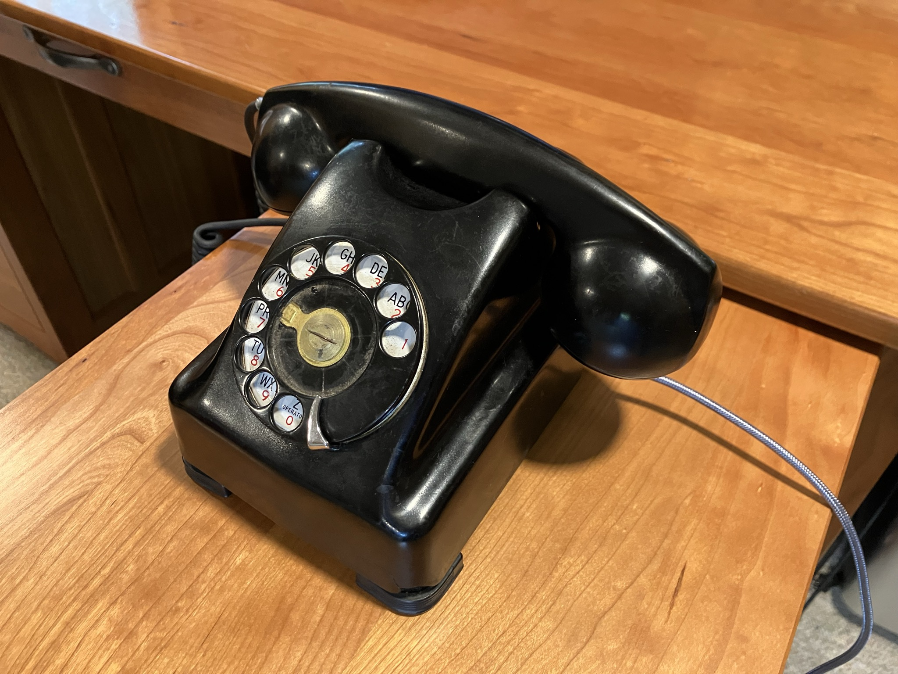

# Kellog branch of weeBell Bluetooth Handsfree

Significant changes in scope... Used the original electromechanical dial and ringer. Everything else was replaced. more description to come...





## [first] A Shout Out

XXX update credits and references!!!!


## Use:

the dial and handset are the complete user interface. no external screens or buttons.

### getting help

dial 0

### pairing

dial 2


## Test:


hwtest is firmware with RTT interactive test commands used to incrementally build and test board components and interaction with the telephone electromechanical systems.

```bash
cd hwtest
idf.py build
idf.py -p /dev/cu.usbserial-0001 -b 921600 flash monitor
```


## Building the ????
xxx

The project was developed using Espressif IDF v4.4.4 and creates firmware to run on [gCore](https://github.com/danjulio/gCore).  The project is contained in the ```gcore_pots_bt``` directory.  These instructions assume that the IDF is installed and configured in a shell window (instructions at Espressif's [Getting Started](https://docs.espressif.com/projects/esp-idf/en/v4.4.4/esp32/get-started/index.html) web page).

### Configure
xxx

The project ```sdkconfig``` is preconfigured with options for the project.  These typically should not need to be changed but it is important to use these configuration items since many optimizations and specific IDF configuration changes have been made.

### Build

xxx


```bash
```

```bash
```


```idf.py build```

### Build and flash
Connect gCore to your computer and turn on.  It should enumerate as a USB serial device.  You will use the serial port device file name (Linux, OS X) or COM port (Windows) in the command below (PORT).

```idf.py -p [PORT] flash```

or 

```idf.py -p [PORT] flash monitor```

to also open a serial connection after programming so you can see diagnostic messages printed by the firmware to the serial port (```idf.py -p [PORT] monitor``` to simply open a serial connection).


